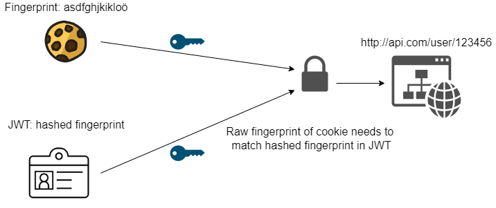

# Asterisk-Backend

A secured Spring Boot REST backend application using JWT and Postgresql. It manages
and authenticates Users.

- [Introduction](#introduction)
- [Setup](#setup)
- [Architecture](#architecture)
- [Routes](#routes)
  - [Public](#public)
  - [Protected](#protected)

## Introduction
As already said this backend is using JWTs to handle the authorization of protected routes. It does that utilizing a "two-part key". 
This means that in order for a user to be granted access to a certain protected route, he needs both a valid JWT **and** the associated fingerprint contained in a cookie.

The JWT itself is stored in the ``localStorage`` (Web) or ``SharedPreferences`` (Mobile) while the fingerprint is stored in a httponly secured cookie.

This approach is directly taken from the [OWASP JWT Cheat Sheet](https://cheatsheetseries.owasp.org/cheatsheets/JSON_Web_Token_for_Java_Cheat_Sheet.html#token-sidejacking)

## Setup
For your computer to be able to run this application you need to have maven and java 17 and postgresql installed.

Once this is done go ahead and edit the ``application.properties`` file inside ``/src/main/java/resources``.
Also don't forget to update the ``docker-compose.yaml`` with those same credentials.

## Architecture
Throughout the backend the **D**omain **D**riven **D**esign (DDD) architecture is used.

## Routes

In general routes can be differentiated in three different categories:
* public (Can be accessed by **anyone**)
* protected (Can **only** be accessed by an authenticated user)
  * Also includes **optional** authorization e.g. (Only User himself can edit information about himself)

### Public
Anyone can access these endpoints. Even unauthenticated users.

* ``/healthcheck`` exposes simple health information about the application
* ``/auth/login`` attempts to authenticate the email and password 
* ``/auth/register`` registers a new user and sends a confirmation email
* ``/auth/register/{id}/confirm`` confirms the confirmation email by entering a code

### Protected
Only authenticated and authorized users have access to these endpoints.
* ``/auth/logout`` - only authenticated users should be able to logout
* ``/user/{id}`` -  reads information about user ``id``

